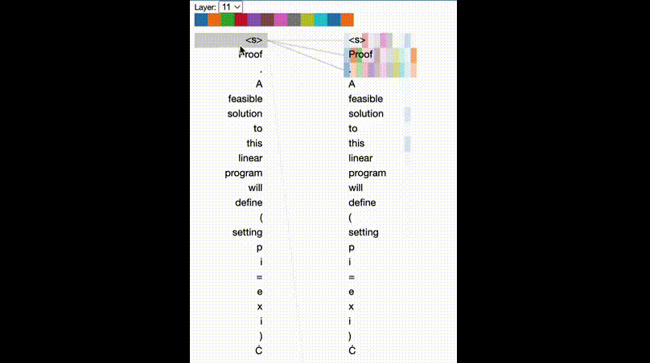
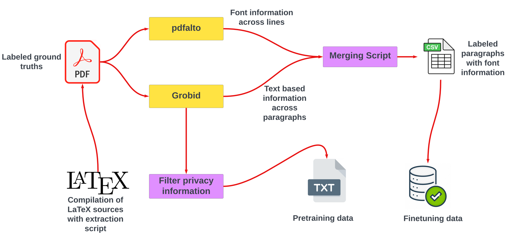
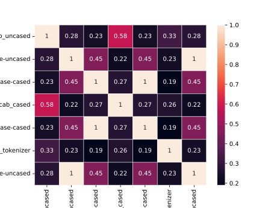

# Multimodal Machine Learning for Extraction of Theorems and Proofs in the Scientific Literature




This repository provides code, data, and models supplementing the research article **[Multimodal Machine Learning for Extraction of Theorems and
Proofs in the Scientific Literature](https://arxiv.org/pdf/2307.09047.pdf)** by Shrey Mishra, Antoine Gauquier and [Pierre Senellart](https://pierre.senellart.com).

[](https://arxiv.org/pdf/2307.09047.pdf)

The efforts are made in the direction of [Theoremkb](https://github.com/PierreSenellart/theoremkb) project

# What is Multimodal Extraction 🤔❓

The goal of this paper implementation is to provide access to trained machine learning models that can be used to extract proofs and theorems from raw pdfs articles. The classifiers come from various modalities that include the Text, Vision and Font based approaches and even a hybrid Multimodal approach that cumilatively looks at all three modalities to better suggest the label of the paragraph.


Our classifiers also take the sequential information (for ex - label of the previous block the vertical/horizontal distance from the last block, the page number etc) from the paper, which play a very crucial role in deciding the label of the paragraph.

class_names:

1. `BASIC (Neither Proof nor Theorem)`
2. `Proof`
3. `Theorem`
4. `Overlap between Proof and Theorem`

## Using Finetuned model on several modalities

To use these models, you first need to select the type of model form the list of models in the table 👇 and then download it from the link provided below:

| Model name 🚀                                                                | Modality                               | Size 🏋️‍♂️  | Mean Accuracy 📈 | Mean F1 Score 🎯 | Download ⬇️                                                                 |
| :--------------------------------------------------------------------------- | :------------------------------------- | :------- | :--------------- | :--------------- | --------------------------------------------------------------------------- |
| [Roberta-pretrained_from_scratch-ft](finetuning_NLP/roberta_from_scratch_ft) | Text 💬                                | 498.9 MB | 76.45            | 72.33            | [Download from 🤗](https://huggingface.co/ENS-Ulm/roberta_from_scratch_ft)  |
| [Scibert-ft](finetuning_NLP/scibert_base_ft)                                 | Text 💬                                | 440.9 MB | 76.89            | 71.33            | [Download from 🤗](https://huggingface.co/ENS-Ulm/scibert_base_ft)          |
| [LSTM](finetuning_seq/lstm_font.h5)                                          | Font Seq 🖊️                            | 21 MB    | 65.00            | 45.00            | [Download from 🤗](https://huggingface.co/ENS-Ulm/lstm_font_seq_ordering)   |
| [Bi-LSTM](finetuning_seq/blstm_font.h5)                                      | Font Seq 🖊️                            | 22 MB    | 68.26            | 45.66            | [Download from 🤗](https://huggingface.co/ENS-Ulm/Bi-LSTM/tree/main)        |
| [EfficientnetB4](finetuning_vis/new_models/r_efficientnetB4_avg11.h5)        | Vision 👁️                              | 211.5 MB | 68.46            | 54.33            | [Download from 🤗](https://huggingface.co/ENS-Ulm/Efficientnet_vision)      |
| [EfficientNetV2m](finetuning_vis/new_models/r_efficientnetv2m_avg11.h5)      | Vision 👁️                              | 638.3 MB | 69.43            | 60.33            | [Download from 🤗](https://huggingface.co/ENS-Ulm/EfficientNetV2m_for_para) |
| [GMU model 🔱 ](finetuning_multimodal/model_4_9)                             | Text 💬 + Font_Seq 🖊️ + Vision 👁️      | 783.5 MB | 76.86            | 73.87            | [Download from 🤗](https://huggingface.co/Shrey/GMU_multimodal/)            |
| CRF-GMU model 🚀                                                             | Sequential Blocks of GMU embeddings 🔗 |          |                  |                  |                                                                             |

```python
#for NLP based model
import numpy as np
import tensorflow as tf

from transformers import AutoTokenizer, AutoModel, utils
from transformers import TFAutoModelForSequenceClassification

#choose a path
load_path="InriaValda/roberta_from_scratch_ft"

#tokenizers
tokenizer = AutoTokenizer.from_pretrained(load_path)
loaded_model = TFAutoModelForSequenceClassification.from_pretrained(load_path, output_attentions=True)

sample1="""Proof. A feasible solution to this linear
program will define (setting p i = e x i )
a sequence p = (p 1 , . . . , p n ) ∈ (0, 1] n such that"""

input_text_tokenized = tokenizer.encode(sample,
                                        truncation=True,
                                        padding=True,
                                        return_tensors="tf")

print(input_text_tokenized)

prediction = loaded_model(input_text_tokenized)

prediction_logits = prediction[0]
prediction_probs = tf.nn.softmax(prediction_logits,axis=1).numpy()

np.set_printoptions(suppress=True)
print(f'The prediction probs are: {prediction_probs}')
print("rounded label(argmax) :{}".format(np.argmax(prediction_probs)))

```

```python
import pickle
import tensorflow as tf
from tensorflow.keras.preprocessing.text import Tokenizer
from tensorflow.keras.preprocessing.sequence import pad_sequences

font_seq= 'cmr10 cmr10 cmr10 cmmi10 cmmi8 cmr10 cmr10'

filepath = "tokenizer_52000_v1.pkl"

#load font encoder
with open(filepath, 'rb') as f:
    tokenizer = pickle.load(f)

val_tokenized_train = tokenizer.texts_to_sequences(font_seq)

max_length=1000 #paddig length
tokenized_font = pad_sequences(val_tokenized_train, maxlen=max_length)

#load model
model_path="lstm_font.h5"
model = tf.keras.models.load_model(model_path)

model.predict(tokenized_font)

y_pred = np.argmax(predictions, axis=1)

print(y_pred)
```

## Dataset Overview

1. [Pretraining data 📚:](./assets/pretrained_language_models/pretraining_code/pretrain_ids.txt) The dataset contains ~196k collected from the [arXiv bulk API](https://info.arxiv.org/help/bulk_data/index.html) the [list](assets/pretrained_language_models/pretraining_code/pretrain_ids.txt) of all the arXiv id's used for pretraining part are mentioned in <mark>./assets/pretrained_language_models/pretraining_code/pretrain_ids.text </mark>
   🔥 🔥 Try the pretraining demo (MLM task) at 🤗 👉 [](https://huggingface.co/spaces/Shrey/cc-bert)

2. [Finetuning data 🔍:](./build_train_test_finetuning_data) This section contains the list of arXiv ids for the pdfs that are divided into training and validation data which is used for finetuning the pretrained models and evaluating them.

Each batch contains 1k pdfs that are feed as a single batch and the scores are reported based on incremental growth per ~1k pdfs, named in the following order:

- [batch_0.txt](./build_train_test_finetuning_data/batch_0.txt)
- [batch_1.txt](./build_train_test_finetuning_data/batch_1.txt)
- [batch_2.txt](./build_train_test_finetuning_data/batch_2.txt)
- ....
- [batch_126.txt](./build_train_test_finetuning_data/batch_126.txt)

<em>\* the batch order is the exact same as they are feed to the model, however internal shuffling (in pdf order) was allowed to avoid overfitting</em>

The validation data remains constant for each modality consisting of 3682 pdfs, see:

- [batch_validation.txt](./build_train_test_finetuning_data/batch_validation.txt)

## Data Pipeline 🚰 and code 💻

A rough dataset pipeline implementation is provided below:



A. The [Data pipeline notebook](<Data_preprocessing/Data pipeline.ipynb>) walks through the enire step of regenerating the labelled ground truths from the obtained latex sources.

<em>It assumes certain dependencies including the [GROBID](https://github.com/kermitt2/grobid) to extract semantically parsed paragraphs and [Pdfalto](https://github.com/kermitt2/pdfalto) to extract font name and their font information.</em>

Here is a description of the .py files used in the Data pipeline notebook:

<ol>
<li>
 
 [tex2pdf.py](<Data_preprocessing/tex2pdf.py>): <mark>Converts latex sources to a pdf</mark> while injecting them with the latex plugin
</li>

<li>

[grobid_clean.py](Data_preprocessing/grobid_clean.py)
:<mark> Applies Grobid on the pdfs to get a .tei.xml extension file</mark>

</li>

<li>

[Pdfalto_on_pdfs.py](Data_preprocessing/pdfalto_on_pdfs.py)
:<mark> Applies pdfalto on pdfs to generate annotations and extract font information</mark>

</li>

<li>

[labelling.py](Data_preprocessing/labelling.py)
:<mark> Visualize the grobid blocks which are then labelled with colors to denote their labels</mark>

</li>

<li>

[dataframe_for_eval.py](Data_preprocessing/dataframe_for_eval.py)
:<mark> Generates the data.csv file that contains the merged output from grobid and Pdfalto</mark>

</li>
</ol>

B. Filter privacy information 🙈: This
[notebook](<Data_preprocessing/pretraining_data/Generating text file and training tokenizer.ipynb>) generates the text files from scientific papers filtering the author information and the references. It then genrates the tokenizer on this large pretraining dataset [vocabulary](assets/pretrained_language_models/pretraining_code_tokenizer/vocabularies) .



C. Pretrain language model: This
[notebook](<Data_preprocessing/pretraining_data/Pre-train language models.ipynb>) walks through the process of pretraining both BERT/Roberta style pretraining on scientific papers (see the [full list of papers](/Users/mv96/Downloads/ACM_Multimedia/assets/pretrained_language_models/pretraining_code/pretrain_ids.txt))

The same pretrained models are also available on the hugging face model hub 🤗, see the table below 👇

<!---
| BERT base | [Download 🤗](https://huggingface.co/bert-base-uncased) | Books Corpus and English Wiki | 16 GB |
| RoBERTa base |[Download 🤗](https://huggingface.co/roberta-base) | English wiki, common crawl etc | 160 GB |
-->

| Models 🔥                 |                                                               Get Frozen Weights ❄️                                                               |        Data Type         | Data size |
| :------------------------ | :-----------------------------------------------------------------------------------------------------------------------------------------------: | :----------------------: | :-------- |
| BERT (Ours 🔥)            |         [Download from 🤗](https://huggingface.co/Shrey/cc_math_bert_ep10) or [here](assets/pretrained_language_models/cc_math_bert_ep10)         | Scientific Papers (197k) | 11 GB     |
| RoBERTa (Ours ＠ ep01 🔥) |      [Download from 🤗](https://huggingface.co/Shrey/cc_math_roberta_ep01) or [here](assets/pretrained_language_models/cc_math_roberta_ep01)      | Scientific Papers (197k) | 11 GB     |
| RoBERTa (Ours ＠ ep10 🔥) | [Download from 🤗](https://huggingface.co/Shrey/cc_math_roberta_ep10/tree/main) or [here](assets/pretrained_language_models/cc_math_roberta_ep10) | Scientific Papers (197k) | 11 GB     |

D. Finetuning models (Proof/theorem identification task): several notebooks demonstrate:

1. `Finetuning NLP model`: This [notebook](finetuning_NLP/training_language_model.ipynb) demonstrates how to finetune a pretrained language model.

2. `Finetuning font based model`:
   This [notebook](finetuning_seq/training_seq.ipynb) demonstrates how to train a font based sequential model that captures the font sequence to decide the label of the block.

3. `Finetnuning Vision model`: This [notebook](finetuning_vis/training_vision_models.ipynb) demonstrates the training of the visions model.

<em>\* All images must be inverted to a input dimension of 400 ❌ 1400 and padded relatively

To generate the patches refer these notebooks for [train](<finetuning_vis/data_generation_patches/generating_patches train.ipynb>) and [validation](finetuning_vis/data_generation_patches/generating_patches.ipynb) data respectively,
to apply transformation on generated patches refer this [notebook](finetuning_vis/data_generation_patches/image_transformation.ipynb)
</em>

4. `Finetuning Multimodal (GMU)`:The GMU model is based upon this [paper](https://arxiv.org/pdf/1702.01992.pdf) using the Font sequence model, language model and the vision model feeding in a gated network to decide the importance of each modality, please refer this [notebook](finetuning_multimodal/multimodal_pred_0205.ipynb) for the implemenation.

5. `Finetuning Sequential models`:

## Related

This project is part of the [Theoremkb](https://github.com/PierreSenellart/theoremkb) Project and related to it's extension.

## FAQ

#### Q1) Can I use these models to fine-tune on a similar task?

Certainly! 👍 Fine-tuning these models on a similar task is one of the valuable use cases. While we have primarily tested these models on proof/theorem extraction tasks, they can be adapted for other tasks as well. Finetuning on a different task can yield promising results. We encourage you to explore the potential and let us know if you achieve something remarkable with them 🤩.

#### Q2) Are these models available in PyTorch?

Regrettably, these models are currently only available in TensorFlow. At present, we do not provide direct support for PyTorch. However, we are continuously expanding our offerings, so please stay updated for any future developments.

## Acknowledgements

This work has been funded by the French government under
management of [Agence Nationale de la Recherche](https://anr.fr/) as part of the
“Investissements d’avenir” program, reference [ANR-19-P3IA-0001](https://anr.fr/ProjetIA-19-P3IA-0001)
([PRAIRIE 3IA Institute](https://prairie-institute.fr/)).

Pierre Senellart's work is also supported by his secondment to [Institut
Universitaire de France](https://www.iufrance.fr/).

## Contributing

Contributions and collaborations are always welcome!

We are always looking for interesting candidates, Please contact pierre@senellart.com 📧 , If you are interested.

## 🔗 Reach out to Us 💜

✅Shrey Mishra: mishra@di.ens.fr

[](https://www.linkedin.com/in/shreymishramv96/?originalSubdomain=fr)

✅Antoine Gauquier: antoine.gauquier@ens.psl.eu

[](https://www.linkedin.com/in/antoine-gauquier-0a176b152/)

✅Pierre Senellart: pierre@senellart.com

[](https://pierre.senellart.com)

[](https://www.linkedin.com/in/pierresenellart/)
